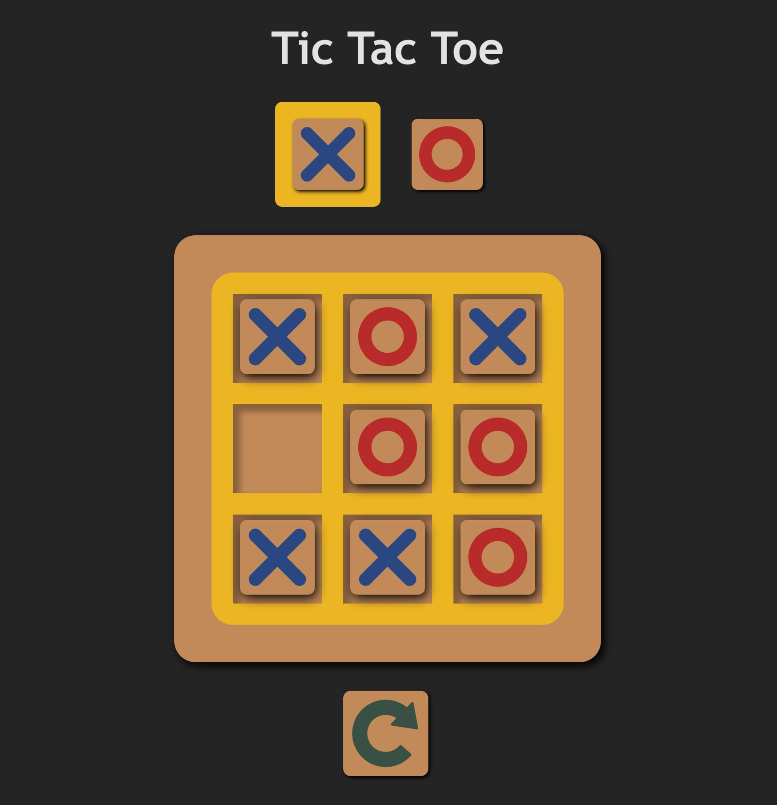

# Tic-Tac-Toe (Reactjs)

## Description

This is a simple page build with react using [useStated](https://react.dev/reference/react/useState) also saving in the LocalStorage

Demo: [https://simplecard-react.netlify.app/](https://tresenraya-reactjs.netlify.app)

## Tecnologies
Library: [React](https://react.dev/)

Bundle: [Vite](https://vitejs.dev/)

Deploy: [Netlify](https://www.netlify.com/)

Dependencies: [canvas-cofetti](https://www.npmjs.com/package/canvas-confetti)
